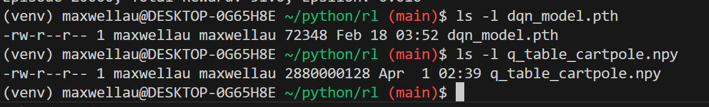
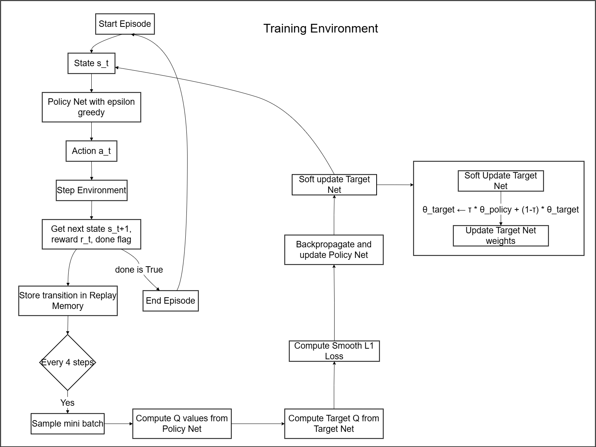
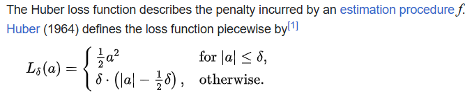

# Q learning with Cartpole

Hi TA! This is an implementation of the Deep Q Learning agent using Pytorch. Please understand that I steered away from ChatGPT in order to deeply understand this topic (because GenAI coding is for losers), so please understand if there are any typos in my code.

# Running the code

Install requirements if running on local using virtual env + jupyter notebook combination.

**Note** I am using **gymnasium** (newer version of gym) for the video processing.

```
python -m venv venv
source venv/bin/activate
pip install requirement.txt
```

To train the model (not needed for the demo)

```
source venv/bin/activate
python DQNAgent.py
```

To view the performance, simply select the venv as your runtime kernel in your jupyter notebook and run it procedurally.

If running in VSCode,

Now... here is my journey! For more detailed info, refer to my source in DQNAgent.py and QTableAgent.py respectively.

# Chapter 1. Trying out normal Q Tables

After looking through the lecture notes, i found this tutorial on YouTube by <a href="https://www.youtube.com/watch?v=yMk_XtIEzH8&list=PLQVvvaa0QuDezJFIOU5wDdfy4e9vdnx-7">sentdex</a>, where he implemented a Q-table from scratch for MountainCar

I tried to complete this task using a normal Q table, but i failed miserably. Please refer to QTableAgent.py for implementation (also let me know if i did anything wrong). Below is an example of my results.

```
Episode 12552, Total Reward: 20.0, Epsilon: 0.010
Episode 12553, Total Reward: 126.0, Epsilon: 0.010
Episode 12554, Total Reward: 12.0, Epsilon: 0.010
Episode 12555, Total Reward: 10.0, Epsilon: 0.010
Episode 12556, Total Reward: 41.0, Epsilon: 0.010
Episode 12557, Total Reward: 19.0, Epsilon: 0.010
Episode 12558, Total Reward: 12.0, Epsilon: 0.010
Episode 12559, Total Reward: 14.0, Epsilon: 0.010
Episode 12560, Total Reward: 59.0, Epsilon: 0.010
Episode 12561, Total Reward: 19.0, Epsilon: 0.010
```

Absolute garbage! In hindsight, I should have probably used the better epsilon decay policy that I used in my DQNAgent class, but this was terrible! Further more, after I saved the model, I realised that the Q table itself was 2.68GB, compared to a mere 72KB of my DQN model! 😭😭😭



Needless to say, I have failed with my manual Q Table approach, thus I decided to venture to...

# Chapter 2. DQN with Pytorch

To by honest, I am more familiar with TensorFlow, but decided to challenge myself to learn Pytorch for this project. I followed the <a href="https://pytorch.org/tutorials/intermediate/reinforcement_q_learning.html">official PyTorch DQN tutorial</a> as a base, but I added quite a few customizations and cleaned up the code with detailed comments to reinforce my understanding.

## Key features in my implementation

### 1. Replay memory

To be very honest, I copied it straight from Pytorch documentation (because it does exactly what I want it to do).
It just stores past experience in a queue

### 2. Policy Net vs Target Net

We use 2 networks in our training cycle

1.  The Policy Network is used to make the decisions, gets trained in real time.
2.  The Target Network is used for soft updating the weights to Policy Net.

https://stackoverflow.com/questions/54237327/why-is-a-target-network-required

Conceptually it's like saying, "I have an idea of how to play this well,
I'm going to try it out for a bit until I find something better"
as opposed to saying "I'm going to retrain myself how to play this
entire game after every move". By giving your network more time to
consider many actions that have taken place recently instead of
updating all the time, it hopefully finds a more robust model before you
start using it to make actions.



So, the flow is as such.

PolicyNet plays the game, gets trained every tick

Every 4 ticks, the Target Net will get updated following
$$ θ′ ← τ θ + (1 −τ )θ′ $$
Where θ′ is the Target Network, θ is the Policy Network, for each corresponding weight.

Override PolicyNet = TargetNet

This reduces Q-value oscillation and improves learning stability.

### Epsilon Decay:

Rather than using a simple linear or constant decay, I implemented a smooth exponential decay:
$$\ f\left(x\right)=min\ +\ \left(max\ -\ min\right)\ \cdot\left(e\right)^{\left(\frac{-x}{1000}\right)} $$
In my implementation, min = 0.05, max = 0.9.

This balances exploration and exploitation better than my previous naive Q-table decay, which was basically a random walk simulator at the end 😅.

### Huber Loss:

For training, I opted for the SmoothL1Loss (Huber loss) instead of MSE. It's more robust to outliers and helped with noisy transitions, especially when early training TD-errors are huge.

Why Huber Loss?

https://en.wikipedia.org/wiki/Huber_loss



Huber loss behaves like MSE for small errors, and MAE for large errors.
So large Temporal Differences will have a disproportionately large impact on the loss. Huber loss dampens those big errors, preventing exploding gradients and overshooting updates

### Gradient Clipping

Prevented exploding gradients using clip*grad_value*. Surprisingly useful even in a seemingly "simple" game like CartPole.

## Results

Although I set my DQN agent to train for 10,000 episodes, with optimize_model() running every 4 environment steps to improve efficiency. The model eventually converged after about 1500 episodes

```
Episode 1457, Total Reward: 403.0
Episode 1458, Total Reward: 240.0
Episode 1459, Total Reward: 182.0
Episode 1460, Total Reward: 500.0
Episode 1461, Total Reward: 500.0
Episode 1462, Total Reward: 500.0
Episode 1463, Total Reward: 500.0
Episode 1464, Total Reward: 500.0
...
```

## Playing

After training, I evaluated the model using the play() function — with exploration turned off. This allows the agent to act purely based on the learned policy (greedy actions). Here's a sample result:

```
Episode 1, Total Reward: 500.0
Episode 2, Total Reward: 500.0
Episode 3, Total Reward: 500.0
...
```

# Chapter 3. Reflections and Improvements

## What went well:

-   I learned a ton about PyTorch’s tensor operations and module system.
-   Learned to structure an RL agent cleanly using object-oriented design.
-   Built a solid understanding of why using target networks and experience replay is not optional.

## What could be better:

-   My earlier Q-table attempt failed because I didn’t discretize the continuous space well — and my table blew up in size.

-   My epsilon decay was simply a linear decrease in my QTable implementation. Could have used a similar policy as the decay strategy used in my DQNAgent.

-   Training took a long time — next time, I could integrate Double DQN or Prioritized Replay to improve sample efficiency.

# Chapter 4. Conclusion

While my initial attempts at Q-tables flopped harder than a bad NFT launch, I managed to pull through with PyTorch and build a working DQN from scratch. I intentionally avoided using AI tools for the implementation phase, because I wanted to truly understand the core mechanics behind reinforcement learning — and honestly, I’m proud of what I built.

If you’ve read this far:
Thanks TA, I hope you had fun reviewing this! 🙏
大哥，請您給我個 A PLEASE PLEASE
